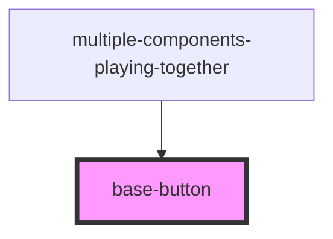

# base-button

<!-- Auto Generated Below -->

## Properties

| Property            | Attribute             | Description | Type      | Default         |
| ------------------- | --------------------- | ----------- | --------- | --------------- |
| `color`             | `color`               |             | `string`  | `'Red'`         |
| `hasRoundedCorners` | `has-rounded-corners` |             | `boolean` | `false`         |
| `isDisabled`        | `is-disabled`         |             | `boolean` | `false`         |
| `text`              | `text`                |             | `string`  | `'Hello World'` |

## Dependencies

### Used by

 - [multiple-components-playing-together](../mulitple-components-playing-together)

### Graph

----------------------------------------------

*Built with [StencilJS](https://stenciljs.com/)*
