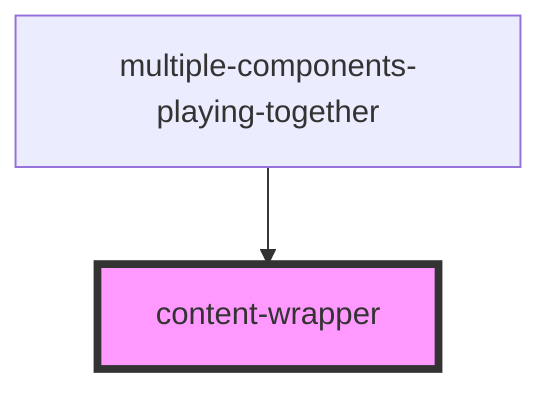

# content-wrapper

<!-- Auto Generated Below -->

## Properties

| Property         | Attribute         | Description | Type     | Default   |
| ---------------- | ----------------- | ----------- | -------- | --------- |
| `constraintSize` | `constraint-size` |             | `string` | `'small'` |
| `paddingSize`    | `padding-size`    |             | `string` | `'small'` |

## Dependencies

### Used by

 - [multiple-components-playing-together](../mulitple-components-playing-together)

### Graph

----------------------------------------------

*Built with [StencilJS](https://stenciljs.com/)*
