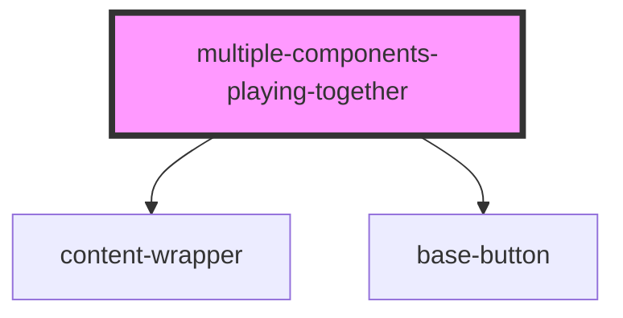

# multiple-components-playing-together

<!-- Auto Generated Below -->

## Properties

| Property            | Attribute             | Description | Type      | Default         |
| ------------------- | --------------------- | ----------- | --------- | --------------- |
| `color`             | `color`               |             | `string`  | `'Red'`         |
| `constraintSize`    | `constraint-size`     |             | `string`  | `undefined`     |
| `hasRoundedCorners` | `has-rounded-corners` |             | `boolean` | `false`         |
| `isDisabled`        | `is-disabled`         |             | `boolean` | `false`         |
| `paddingSize`       | `padding-size`        |             | `string`  | `undefined`     |
| `text`              | `text`                |             | `string`  | `'Hello World'` |

## Dependencies

### Depends on

- [content-wrapper](../content-wrapper)
- [base-button](../base-button)

### Graph

----------------------------------------------

*Built with [StencilJS](https://stenciljs.com/)*
